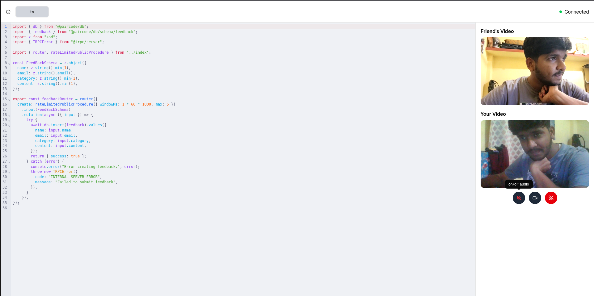
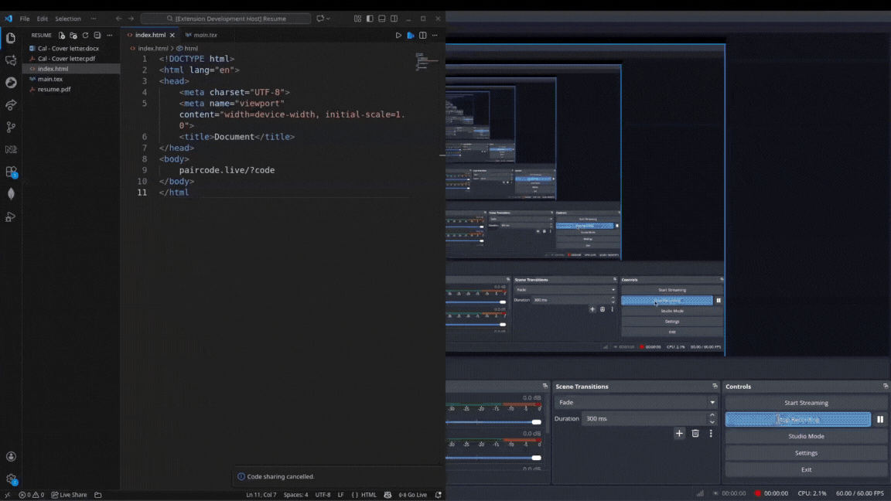

# PairCode.live

## Features

- Pair video call with audio/video control
- LSP supported Real Time editor
- VSCode Extension to import code directly from IDE
  [See more](https://paircode.live/vscode-extension)

## Previews

### Website

### VSCode extension ([More details](https://paircode.live/vscode-extension))

## Setup & Contribution

Please check [contributing.md](https://github.com/bandhan-majumder/paircode.live/blob/main/CONTRIBUTING.md) for more details

## Special Thanks

Special thanks to these projects for making PairCode possible (but not limited to):

[Better-T-Stack](https://github.com/AmanVarshney01/create-better-t-stack) a
modern TypeScript stack that combines Next.js, Express, and more.

[react-codemirror](https://uiwjs.github.io/react-codemirror/) CodeMirror 6 component for React.
and webRTC apis provided by browser.

[WebRTC](https://webrtc.org/) - Real-time communication for the web

[Drizzle](https://orm.drizzle.team/) - A headless TypeScript ORM with a head

[Yo Code](https://vscode-docs.readthedocs.io/en/stable/tools/yocode/) - Extension Generator

[Cert Bot](https://certbot.eff.org/) - A free, open source software tool for automatically using Let’s Encrypt certificates on manually-administrated websites to enable HTTPS.

[Nginx](https://nginx.org/) - An HTTP web server, reverse proxy, content cache, load balancer, TCP/UDP proxy server, and mail proxy server.
